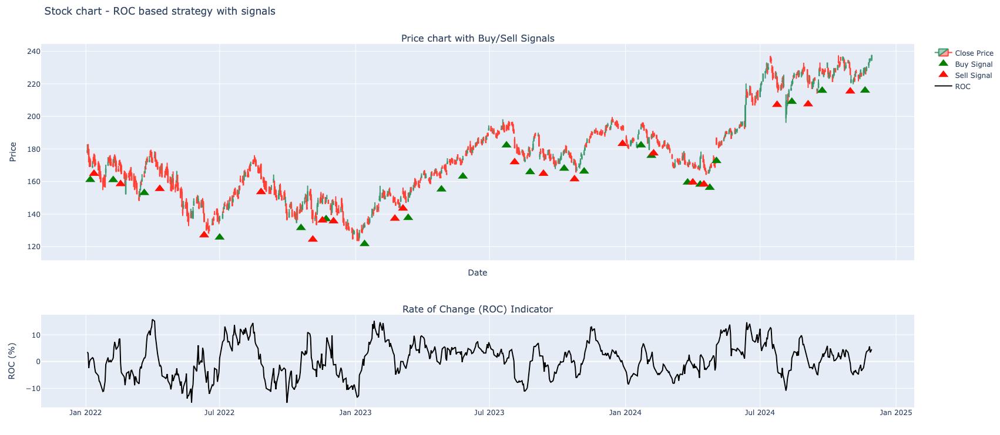
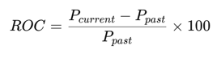

# ROC-based Trading Strategy



This Python script implements a simple system for a testing stock trading strategy based on the **Rate of Change (ROC)**
indicator.
It analyzes daily historical stock data, calculates the ROC indicator, generates buy and sell signals based on the ROC,
and evaluates the performance of the strategy by calculating profit, win rate, and other metrics.

## Table of contents

1. [Overview](#overview)
2. [Dependencies](#dependencies)
3. [How it Works](#how-it-works)
    - [1. Parse Data](#1-parse-data)
    - [2. Calculate ROC](#2-calculate-roc)
    - [3. Generate Signals](#3-generate-signals)
    - [4. Prepare Actions](#4-prepare-actions)
    - [5. Backtesting Logic](#5-backtesting-logic)
4. [How to Use](#how-to-use)
5. [Example Output](#example-output)

## Overview

The strategy uses the **Rate of Change (ROC)** indicator, which measures the percentage change in the price of a stock
over a specific time period.
In this script, the ROC indicator is used to generate buy and sell signals:

- **Buy Signal**: When the ROC indicator is positive, indicating upward momentum.
- **Sell Signal**: When the ROC indicator is negative, indicating downward momentum.

After generating signals, the script simulates a trading strategy, buys the stock after a "buy" signal, and sells it
after a "sell" signal.
The performance is evaluated based on the total profit, win rate, and average profit per trade.

## Dependencies

The following Python packages are required to run the script:

- `plotly` - for plotting interactive charts.
- `pandas` - for handling data.
- `ta` - for calculating the Rate of Change (ROC) indicator.
- `datetime` - for handling date and time.

Install the required dependencies using:

```bash
pip install plotly pandas ta
```

## How it works

### 1. Parse Data

The function `parse_data(file_name)` reads historical stock data from a CSV file. The CSV file should contain the
following columns:

- `timestamp`: timestamp of the stock price, in my case daily points were considered.
- `open`: Opening price of the stock.
- `high`: Highest price of the stock during the trading session.
- `low`: Lowest price of the stock during the trading session.
- `close`: Closing price of the stock.
- `volume`: Volume of stock traded.

The function converts the data into a Pandas DataFrame and filters out entries before January 1, 1999.
Disclaimer: no logic behind it, just saw on a graph, that there is no so many data points for AAPL,
the ticker I was using while developing the strategy.

### 2. Calculate ROC

The `get_roc_indicator(data, roc_window)` function computes the **Rate of Change (ROC)** indicator for the stock’s
closing price.
The ROC measures the percentage change in price over a given number of periods (`roc_window`), and is calculated as:



Where:

- `P_current` is the current price.
- `P_past` is the price from `roc_window` periods ago.

### 3. Generate Signals

The function `prepare_buy_sell_signals(data)` creates a new column, `signal`, which is set to:

- **1** for a "buy" signal (ROC > 0).
- **-1** for a "sell" signal (ROC < 0).
- **0** for neutral/hold.

### 4. Prepare Actions

This is the whole idea of the strategy.

In `prepare_buy_sell_actions(data)`, the script assigns an action (`buy` or `sell`) based on the generated signals:

- A **buy** is executed **2 bars** after a positive ROC.
- A **sell** is executed **2 bars** after a negative ROC.

This delay simulates a more cautious trading strategy, allowing the price to stabilize before taking action.

Take also into consideration, the strategy is based this way, once there is a first `buy` signal, we buy 1 stock for the
asked price.
This is an opened position or opened trade, to close the position I need to get a `sell` signal. On `sell` we sell
everything.
If after `buy` signal we get another `buy` signal, we consider it still as an opened position, opened the previous time.
And we keep buying.
We accumulate such signals and trades, and then we sell everything the time we got `sell` signal and go to next `buy`.

### 5. Backtesting Logic

The `main` function is responsible for running the backtesting strategy:

- It loads the data, calculates the ROC, generates signals, and prepares the buy/sell actions.
- The script then simulates buying and selling based on the signals and tracks the profit for each trade.
- Performance metrics such as total profit, win rate, and average profit per trade are calculated and printed.

## How to Use

To run the script, you need to have a CSV file containing the daily historical stock data, which you will pass as an argument
to the `main()` function. You will also specify the ROC window (typically between 10 and 30), and the date range for
analysis.

### Command

```python
main(stock_data_file_name, roc_window, start_date, end_date)
```

- `stock_data_file_name`: Path to the CSV file with historical stock data.
- `roc_window`: The window size for calculating the ROC indicator (e.g., 14).
- `start_date`: The start date for analysis in YYYY-MM-DD format.
- `end_date`: The end date for analysis in YYYY-MM-DD format.

Example:

```python
main('./resources/AAPL.csv', 14, start_date='2022-01-01', end_date='2024-12-31')
```

This will backtest the strategy on Apple (AAPL) stock data from January 1, 2022, to December 31, 2024, using a 14-period
ROC window.

### Example Output

Once the strategy completes, the following output will be printed:

```
Total Profit: 120.55
Total Trades: 45
Win Rate: 62.22%
Average Profit per Trade: 2.68
Number of Wins: 28, Number of Losses: 17
```

- **Total Profit**: The total profit generated from all trades.
- **Total Trades**: The number of trades executed.
- **Win Rate**: The percentage of trades that were profitable.
- **Average Profit per Trade**: The average profit per trade across all trades.
- **Number of Wins/Losses**: The total count of winning and losing trades.

### Performance Evaluation

- **Win Rate**: A higher win rate indicates a more successful strategy. A win rate above 50% is usually considered
  profitable for trading strategies.
- **Total Profit**: Represents the overall performance. A positive total profit is an indicator of success.
- **Average Profit per Trade**: This should ideally be positive. A higher average profit suggests the strategy's
  efficiency.

### Sources

1. https://chartschool.stockcharts.com/table-of-contents/technical-indicators-and-overlays/technical-indicators/rate-of-change-roc
2. https://tradeciety.com/how-to-use-moving-averages