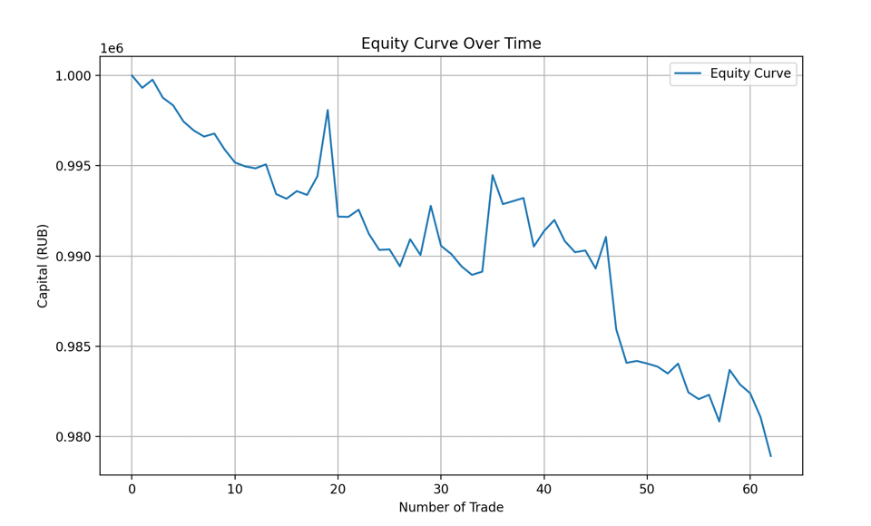

# Часть Первая

## 1. Введение

В данном отчете описывается тестирование торговой стратегии, основанной на пересечении скользящих средних (SMA20/40) с
использованием подхода управления капиталом по методу Анти-Мартингейла.

Целью данного исследования является оценка эффективности подхода к управлению капиталом по методу Анти-Мартингейла. В
рассматриваемой модели используется стратегия пересечения скользящих средних:

- **Long:** когда 20-дневная скользящая средняя (SMA20) пересекает 40-дневную (SMA40) снизу вверх;
- **Short:** когда SMA20 пересекает SMA40 сверху вниз.

Для управления капиталом применен метод Анти-Мартингейла, при котором размер сделки увеличивается (умножается) после
каждой прибыльной сделки и сбрасывается до исходного значения после убыточной.

Вычисления выполнены с помощью языка программирования Python и пакета для аналитики данных Pandas.

---

## 2. Методология

- **Исходные данные:**
  Расчет проводился для компании ГМК Лукойл.
  Исторические данные актива загружаются из файла (например, `GMKN.csv`). Данные содержат цены закрытия, на основании
  которых рассчитываются индикаторы.

- **Индикаторы:**  
  Рассчитываются две скользящие средние с помощью библиотеки `ta`:
    - **SMA20:** скользящая средняя за 20 дней,
    - **SMA40:** скользящая средняя за 40 дней.

- **Генерация сигналов:**
    - Если SMA20 > SMA40, то сигнал равен **1** (открытие длинной позиции);
    - Если SMA20 < SMA40, то сигнал равен **-1** (открытие короткой позиции).

- **Симуляция торговли с антимартингейлом:**
    - **Начальный капитал:** 1 000 000 руб.
    - **Базовый размер сделки:** 1% от начального капитала (10 000 руб.).
    - **Антимартингейл:**  
      После каждой прибыльной сделки множитель позиции удваивается, что увеличивает размер следующей сделки. При
      убыточной сделке множитель сбрасывается до 1.
    - При изменении сигнала происходит закрытие текущей позиции и открытие новой (в зависимости от сигнала это может
      быть открытие короткой или длинной позиций).

- **Расчет показателей эффективности:**  
  Рассчитываются следующие метрики:
    1. **Общая прибыль:** разница между конечным капиталом и начальным.
    2. **Стандартное отклонение прибыли по сделкам:** как показатель показатель волатильности результатов.
    3. **Максимальная просадка (%):** наибольшее падение капитала от пикового значения.
    4. **Sharpe Ratio:** отношение средней прибыли по сделкам к стандартному отклонению прибыли.

---

## 3. Пример таблицы с деталями сделок и кривая equity

Ниже приведен пример таблицы с деталями сделок, полученной в ходе тестирования:

| Index | Entry Date | Exit Date  | Trade Size | Capital After Trade |
|-------|------------|------------|------------|---------------------|
| 0     | 2015-03-03 | 2015-03-18 | 10000.0    | 999313.588850       |
| 1     | 2015-03-18 | 2015-05-21 | 10000.0    | 999764.393190       |
| 2     | 2015-05-21 | 2015-06-09 | 20000.0    | 998767.331486       |
| 3     | 2015-06-09 | 2015-08-07 | 10000.0    | 998343.663823       |
| 4     | 2015-08-07 | 2015-10-07 | 10000.0    | 997451.654329       |
| ...   | ...        | ...        | ...        | ...                 |
| 57    | 2024-05-20 | 2024-10-15 | 10000.0    | 983690.545807       |
| 58    | 2024-10-15 | 2024-10-23 | 20000.0    | 982890.545807       |
| 59    | 2024-10-23 | 2024-11-21 | 10000.0    | 982395.154102       |
| 60    | 2024-11-21 | 2024-12-17 | 10000.0    | 981083.408768       |

По графику (да и по таблице) видно, что в итоге в совокупности всех сделок, мы все равно приходим к убытку,
что говорит о том, что наша стратегия не является выйгрышной в долгосрочной перспективе.

---

## 4. Результаты тестирования

В результате симуляции получены следующие показатели:

- **Общая прибыль:** -21077.05 руб.
- **Стандартное отклонение прибыли по сделкам:** 1633.37 руб.
- **Максимальная просадка:** 2.11%
- **Sharpe Ratio:** -0.21

### Анализ показателей:

- **Общая прибыль (-21077.05 руб.):**  
  Отрицательный итоговый результат указывает на то, что стратегия в сумме привела к убыткам, как я и писал выше,
  основываясь на графике equity. Это может свидетельствовать
  о неэффективности выбранного сигнала или недостаточно оптимальном управлении капиталом.

- **Стандартное отклонение прибыли (1633.37 руб.):**  
  Значительное стандартное отклонение (с учетом начальной суммы взода в сделку) отражает высокую изменчивость
  результатов отдельных сделок. Это указывает на высокую волатильность, а при достаточно низкой максимальной просадке (
  см. ниже), говорит о достаточно высоком риске.

- **Максимальная просадка (2.11%):**  
  Просадка показывает, что в худшем случае капитал снижался на 2.11% от своего максимума. Это относительно невысокий
  показатель, что говорит о том, что риск потерь был ограничен.

- **Sharpe Ratio (-0.21):**  
  Отрицательное значение Sharpe Ratio свидетельствует о том, что доходность стратегии отрицательная или прибыль,
  получаемая по сделкам, не компенсирует принятый риск.

---

## 5. Выводы

Тестирование стратегии с использованием подхода Анти-Мартингейла показало, что:

- Несмотря на потенциальное увеличение используемого капитала после выигрышных сделок, общая прибыль оказалась
  отрицательной.
- Волатильность результатов сделок (стандартное отклонение) остается достаточно высокой.
- Максимальная просадка в 2.11% говорит о том, что просадки были ограниченными, однако это не компенсировалось
  достаточной доходностью.
- Отрицательное значение Sharpe Ratio (-0.21) указывает на то, что риск-скорректированная доходность стратегии не
  является приемлемой.

---

# Часть Вторая

## 1. Обзор

Оценка влияния доли капитала, задействованной в сделках, на итоговую прибыль/убыток. В качестве сигнала для входа и
выхода из сделок используется индикатор ROC (Rate of Change) с окном 10.
Задача – определить зависимость финансового результата от фиксированной доли капитала, выделяемой на каждую сделку,
и отобразить эту зависимость на графике.

## 2. Описание

- **Параметры:**
    - **Начальный капитал:** 1 000 000 руб.
    - **Диапазоны размеров сделок:** Тестируются три диапазона процентных значений:
        - От 10% до 90% с шагом 10.
        - От 100% до 900% с шагом 100.
        - От 1000% до 2000% с шагом 1000.  
          Эти диапазоны позволяют оценить, как итоговый результат зависит от доли капитала, выделяемой на сделку.

- **Принцип Тестирование:**  
  Для каждого значения фиксированной доли:
    - Проходя по историческим данным, при получении сигнала покупки позиция открывается, а при получении сигнала
      продажи – закрывается.  
      При закрытии позиции рассчитывается доходность сделки, которая затем умножается на объем сделки, и полученная
      прибыль (или убыток) прибавляется к капиталу. При этом объем сделки пересчитывается для следующей сделки на основе
      обновленного капитала.
    - Если обнаруживается «значительный убыток» (убыток, превышающий начальный капитал), выводится сообщение "
      Significant loss".
    - Итоговая прибыль нормируется к начальному капиталу и сохраняется для построения графика.

## 3. Анализ полученных результатов

- **Логарифмическая шкала:**  
  Использование логарифмической шкалы по оси y помогает отобразить широкий диапазон значений итоговой прибыли, делая
  визуализацию более информативной, особенно если разница между минимальными и максимальными значениями велика.

- **Управление рисками:**  
  Скрипт содержит проверку на «значительный убыток», что позволяет контролировать риски, сигнализируя о потенциально
  опасной динамике капитала, когда убытки превышают начальный депозит.

- **Вывод:**  
  График зависимости итоговой прибыли от доли задействованного капитала поможет определить оптимальную долю, которая
  максимизирует прибыль или минимизирует убытки. При этом можно оценить влияние фиксированного процентного риска на
  торговую стратегию.

## 4. Выводы

### Итоговый график

График в логарифмическом масштабе для отображения широкого диапазона значений Прибыль/Убыток.

#### График без плеча в нормальном масштабе

##### Замечание

От себя добавлю, что рост дохода совсем какой-то плавный, и потерь практически не наблюдается.
Я всегда рад показать свои вычисления и рассуждения, возможно мной где-то была допущена ошибка.